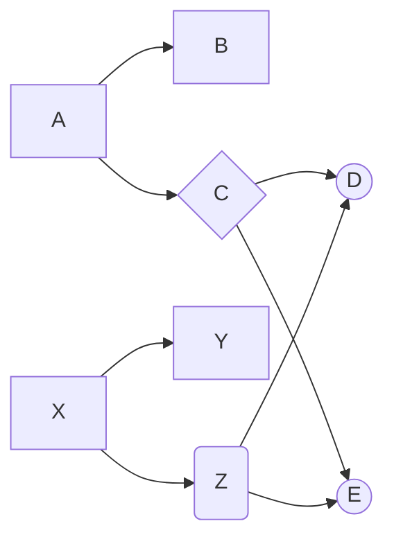

!!! abstract
::: tree

!!! example "Diagram"

!!! todo "TODO"
- [x] Reactive node
- [ ] User interface
    * [ ] Tree builder 
    * [ ] Node builder with formula 
    * [ ] Tree viewer with expandable grid editor
