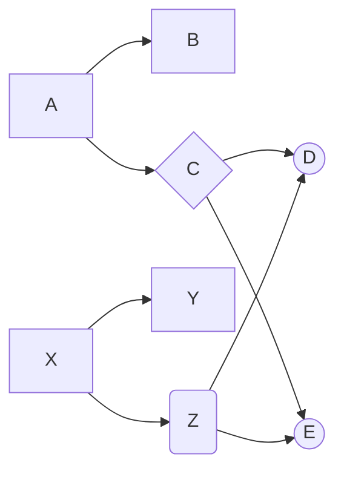

!!! abstract
::: tree

!!! info "Features"
* [x] Reactive 
* [x] Symbolic
* [x] Read only
* [x] Dynamic expression validation and execution
* [x] Dynamic tree builder

!!! example "Diagram"

!!! todo "TODO"
- [ ] Features
  * [ ] Async/Thread support
  * [ ] Echarts utilities
  * [ ] Vxe-table utilities
- [ ] UI
    * [ ] Tree builder 
    * [ ] Node builder with formula 
    * [ ] Tree viewer with expandable grid editor
